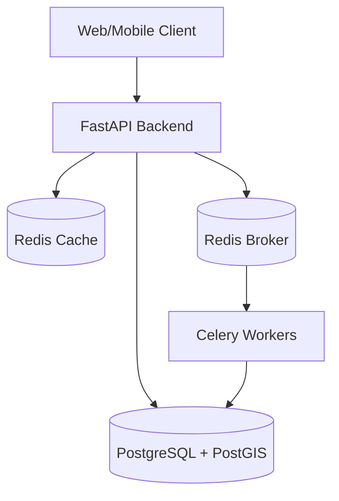
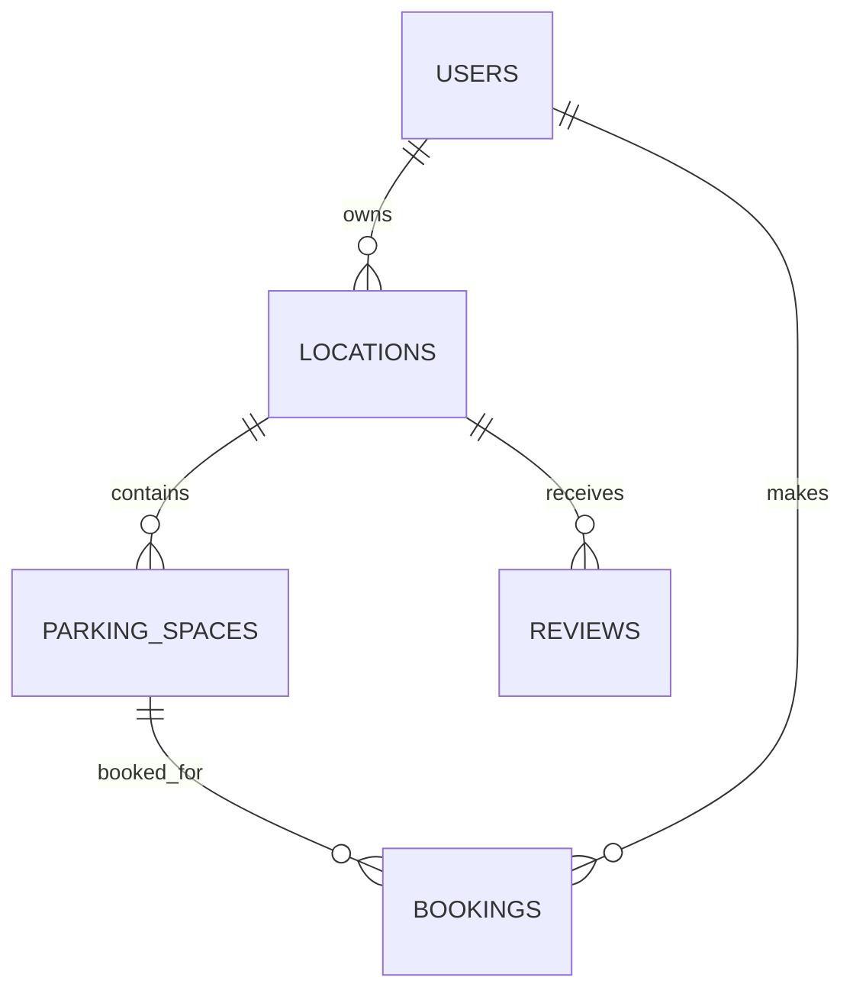

# 🅿 ParkX — Real-Time Parking Marketplace

> ParkX is a real-time parking marketplace that transforms underutilized private and 
> institutional parking spaces into bookable urban infrastructure. Drivers can discover, 
> reserve, pay for and access verified parking in real time, while societies, businesses 
> and property owners can monetize unused parking capacity through intelligent pricing 
> and occupancy management.

## Demo
[Add deployed URL here]

## Features
### For Drivers
- 🗺 Real-time map of nearby parking in Mumbai
- 🔍 Filter by price, vehicle type, amenities, verification status
- ⏱ Time-based availability — see exactly what's free when you need it
- 🔒 Reserve + Pay online (Razorpay / test mode)
- 📱 QR booking pass for seamless check-in
- ⭐ Review parking after use

### For Parking Owners
- 📋 Create and manage parking listings
- 📅 Set custom availability schedules
- 💰 Dynamic pricing recommendations
- 📊 Real-time revenue and occupancy analytics
- 🤖 AI operations assistant (ask: "Why was revenue down this weekend?")
- ✅ Verification badge system

### For Security Staff
- 📷 QR code scanner for check-in
- 👀 View expected arrivals
- 🚗 Track currently parked vehicles
- 📝 Manage check-in and check-out events

### For Societies
- 🏢 Manage 100s of parking spaces
- 🔓 Selectively open spaces to public
- 📈 Occupancy and revenue analytics
- 👥 Manage security staff

## Architecture



## Tech Stack

| Layer | Technology |
|-------|------------|
| Frontend | Next.js 14, TypeScript, Tailwind CSS, shadcn/ui |
| Maps | Mapbox GL JS, react-map-gl |
| State | TanStack Query v5, Zustand |
| Backend | Python, FastAPI, Pydantic v2 |
| Database | PostgreSQL 16 + PostGIS |
| ORM | SQLAlchemy 2.0 (async) |
| Migrations | Alembic |
| Cache/Queue | Redis 7 |
| Workers | Celery |
| Auth | JWT (python-jose + passlib/bcrypt) |
| Payments | Razorpay (Mock provider for dev) |
| AI | Google Gemini (function calling) |
| Deployment | Vercel (frontend) + Railway (backend) |

## Local Development

### Prerequisites
- Docker + Docker Compose
- Node.js 18+
- Python 3.11+

### Quick Start (Docker)

```bash
git clone https://github.com/your-org/parkx
cd parkx
cp backend/.env.example backend/.env
cp frontend/.env.example frontend/.env.local
docker-compose up -d
# Run migrations
docker-compose exec backend alembic upgrade head
# Seed demo data
docker-compose exec backend python -m scripts.seed
# App available at:
# Frontend: http://localhost:3000
# Backend API: http://localhost:8000
# API Docs: http://localhost:8000/docs
```

### Manual Setup

#### Backend
```bash
cd backend
python -m venv venv
source venv/bin/activate
pip install -r requirements.txt
cp .env.example .env  # Edit with your values
alembic upgrade head
python scripts/seed.py
uvicorn app.main:app --reload --port 8000
```

#### Frontend
```bash
cd frontend
npm install
cp .env.example .env.local  # Edit with your values
npm run dev
```

#### Celery Worker
```bash
cd backend
celery -A celery_worker worker --loglevel=info --beat
```

## Environment Variables

### Backend
| Variable | Description |
|----------|-------------|
| DATABASE_URL | PostgreSQL connection string |
| REDIS_URL | Redis connection string |
| JWT_SECRET_KEY | Secret for JWT signing |

### Frontend
| Variable | Description |
|----------|-------------|
| NEXT_PUBLIC_API_URL | Backend API URL |

## Database

### Schema Overview


### Running Migrations
```bash
alembic upgrade head    # Apply all migrations
alembic downgrade -1    # Roll back one migration
alembic history         # Show migration history
```

### Seed Data
```bash
python scripts/seed.py              # Seed demo data
python scripts/seed.py --reset      # Reset and reseed
```

Demo accounts after seeding:
| Role | Email | Password |
|------|-------|----------|
| Admin | admin@parkx.in | Admin@123 |
| Driver | driver1@test.com | Driver@123 |
| Owner | owner1@parkx.in | Owner@123 |
| Security | security1@parkx.in | Security@123 |
| Society | society1@parkx.in | Society@123 |

## API Documentation

FastAPI auto-generates interactive API docs:
- Swagger UI: http://localhost:8000/docs
- ReDoc: http://localhost:8000/redoc

### Key Endpoints

| Method | Endpoint | Description |
|--------|----------|-------------|
| POST | /api/v1/auth/register | Register user |
| POST | /api/v1/auth/login | Login |
| GET | /api/v1/parking/nearby | Geospatial parking search |
| POST | /api/v1/bookings/hold | Create booking hold |
| POST | /api/v1/payments/verify | Verify payment |
| POST | /api/v1/security/validate-qr | Validate QR code |
| POST | /api/v1/security/check-in | Check in vehicle |

## Testing

```bash
cd backend
pytest tests/ -v

# Run concurrency test specifically
pytest tests/test_booking_concurrency.py -v

# Run with coverage
pytest tests/ --cov=app --cov-report=html
```

## Deployment

### Backend (Railway/Render)
1. Connect your GitHub repo
2. Set environment variables
3. Deploy command: `uvicorn app.main:app --host 0.0.0.0 --port $PORT`
4. Run migrations: `alembic upgrade head`

### Frontend (Vercel)
1. Connect GitHub repo
2. Set NEXT_PUBLIC_API_URL to your backend URL
3. Deploy automatically on push

### Database
Use Railway PostgreSQL or Supabase:
- Enable PostGIS extension in database settings
- Get DATABASE_URL from dashboard

## Security
- Passwords hashed with bcrypt (cost factor 12)
- JWT access tokens (30 min) + refresh tokens (7 days)
- Refresh token rotation
- Role-Based Access Control (5 roles)
- Request validation via Pydantic
- SQL injection prevention via SQLAlchemy ORM
- Razorpay webhook signature verification
- Rate limiting (Redis-based)
- CORS configured per environment
- Audit log for all sensitive operations
- Secure QR tokens (secrets.token_urlsafe(32))

## Double-Booking Protection
ParkX implements multi-layer double-booking protection:
1. Redis SET NX lock (30-second race prevention)
2. PostgreSQL SELECT FOR UPDATE row lock
3. Overlap query: checks for conflicting bookings
4. Database-level constraints as final safety net

Concurrent requests for the same slot: only 1 succeeds, all others get 409.

## Booking State Machine
```
PENDING → HELD (checkout started, 8 min timer)
HELD → PAYMENT_PENDING (payment initiated)
PAYMENT_PENDING → CONFIRMED (payment verified by webhook)
CONFIRMED → CHECKED_IN (security scans QR)
CHECKED_IN → COMPLETED (check out)
CONFIRMED → NO_SHOW (no check-in after grace period)
Any → CANCELLED (within policy)
HELD/PAYMENT_PENDING → EXPIRED (timer expires)
```

## Dynamic Pricing
ParkX uses a transparent rules-based pricing engine:
- Base price per hour
- Peak hour multipliers (8-10 AM, 6-9 PM weekdays)
- Weekend pricing
- Demand-based adjustments (high occupancy → price up)
- Low occupancy → discount recommendation

## AI Operations Assistant
The AI assistant uses Google Gemini with function calling.
Every numerical claim comes from real database queries.
Available for parking owners and society admins.

## Future Roadmap
- P3: IoT sensor integration for automated check-in
- P3: ANPR (license plate recognition)
- P3: EV charger management
- P3: Smart gate integration
- P3: Corporate parking accounts
- P3: Parking subscriptions (monthly passes)
- P3: Fleet management
- P3: Navigation optimization
- P3: City-wide demand intelligence

## License
MIT
